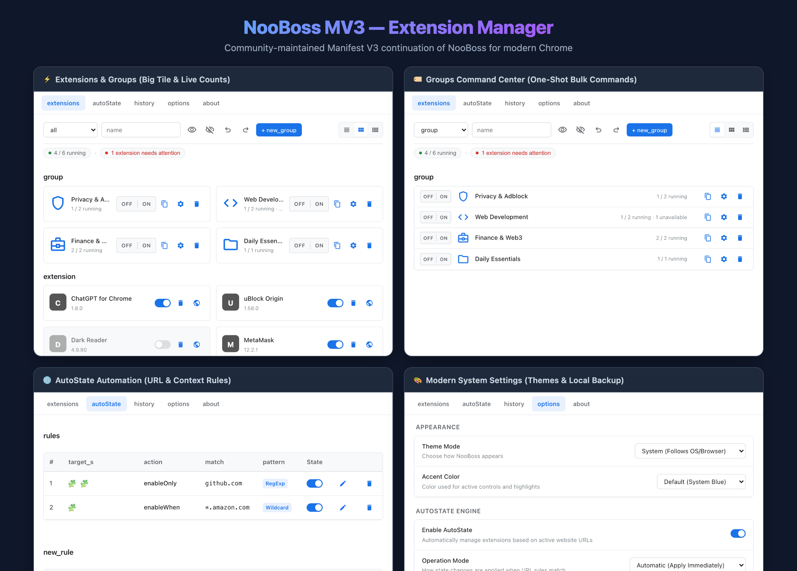
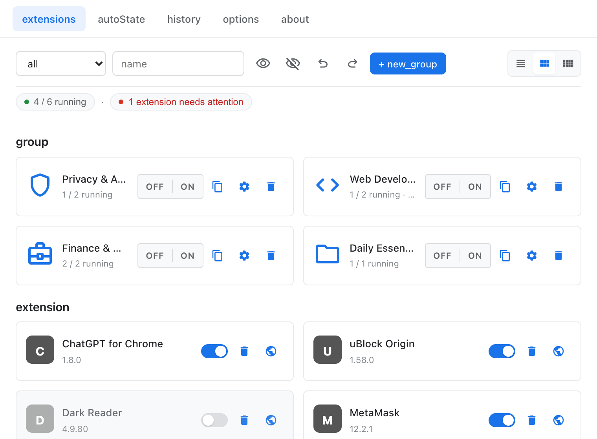
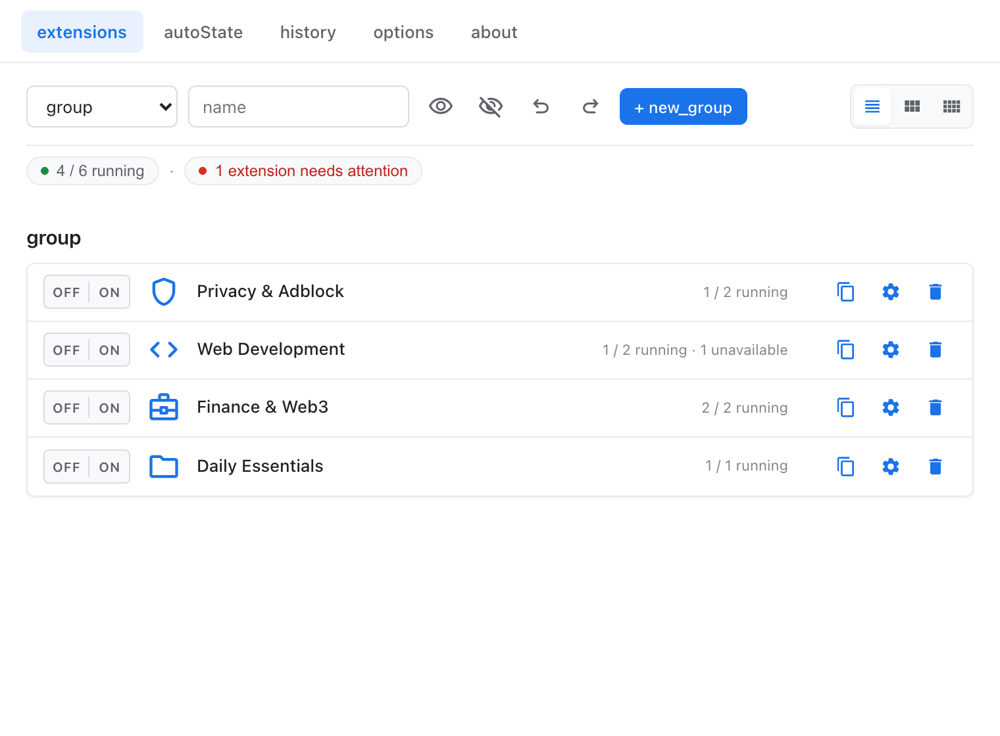
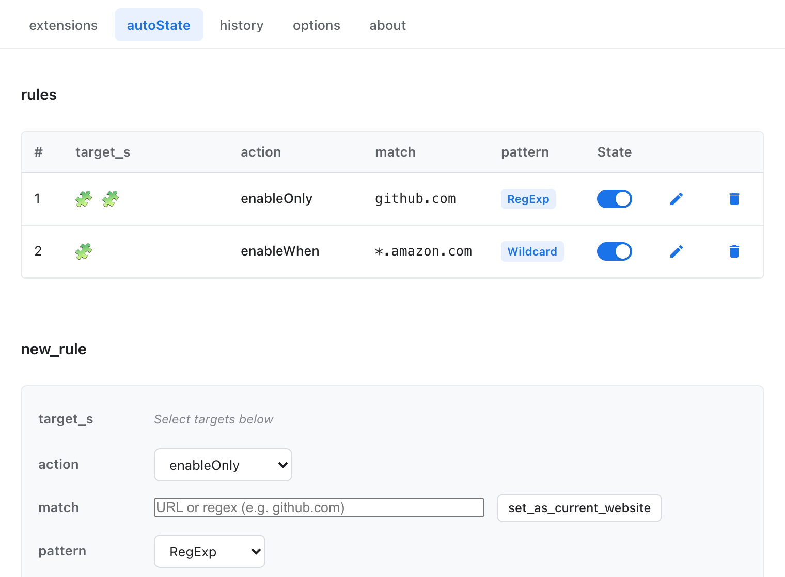
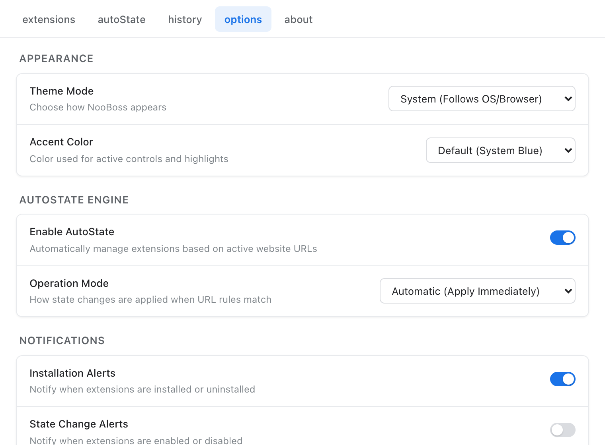

# Extension Drawer

[](https://www.gnu.org/licenses/gpl-3.0)
[](https://developer.chrome.com/docs/extensions/develop/migrate/what-is-mv3)
[]()

> **Extension Drawer** is an independent Manifest V3 browser extension manager built from and inspired by the open-source **NooBoss** project originally created by [AInoob](https://github.com/AInoob).

<p align="center">
  
</p>

---

## Lineage & Motivation

The original **NooBoss**, created by [AInoob](https://github.com/AInoob) ([Original NooBoss Repository](https://github.com/AInoob/NooBoss)), set the benchmark for powerful, visual extension management in Chrome. With the industry-wide transition to Chrome Manifest V3 and the deprecation of Manifest V2, the original extension became incompatible with modern browser releases.

**Extension Drawer** is an independently maintained Manifest V3 continuation. It preserves the classic NooBoss workflow, information architecture, and customization capabilities while adopting a modern Manifest V3 service-worker architecture and clean system-settings UI principles.

- **Current Project Repository**: [Extension Drawer on GitHub](https://github.com/iknoest/NooBoss-MV3-browser-extension-manager)
- **Original Upstream Project**: [NooBoss on GitHub](https://github.com/AInoob/NooBoss)

---

## Key Features

### ⚡ Extension Management
- **Instant Controls**: Enable, disable, open options, inspect Chrome management details, or uninstall extensions in a single click.
- **Visual Contrast**: Distinct grayscale and opacity styling clearly differentiates disabled extensions at a glance without sacrificing switch readability.
- **Multiple View Modes**:
  - **Big Tile**: 2-column balanced layout with quick-action strips and detailed metadata.
  - **List**: Compact 44px rows for high-density extension scanning.
  - **Tile**: Compact grid (up to 6 columns) with interactive hover & keyboard-focus action overlays.
- **Live Search & Type Filters**: Filter by name, extension type (extensions, apps, themes), or runtime state.
- **Bulk Visibility Commands**: One-click bulk Enable (`visibility`) and Disable (`visibility_off`) with multi-level Undo / Redo.
- **Operational Summary Bar**: Live status pill (`X / Y running · Needs attention`) with one-click filtering.

### 🏷️ Command-Based Groups
- **One-Shot Bulk Commands**: Groups feature a compact `[ OFF | ON ]` segmented control that quickly enables or disables all eligible group members in a single gesture.
- **Live Running Counters**: Every group displays its real-time status as `X / Y running` (e.g. `5 / 7 running`).
- **No Enforcement Fighting**: Groups act as convenient command shortcuts without persistent desired-state loops. Overlapping groups and individual extension toggles work together harmoniously.
- **Edge-Case Awareness**:
  - Uninstalled extensions are excluded from active counts and clearly marked (`· 1 missing`).
  - Admin/policy-restricted extensions are noted (`· 1 unavailable`) without blocking bulk commands for remaining eligible members.
- **Rich Icon System**: Choose from over 3,000 self-hosted Material Symbols, curated recommended icons, or upload custom image icons.

### 🌐 AutoState URL Rules
- **Context-Aware Automation**: Automatically enable or disable specific extensions and groups based on active website URLs or domain patterns.
- **Flexible Pattern Matching**: Supports both wildcard patterns (e.g. `*.github.com`) and regular expressions.
- **Assisted & Automatic Modes**: Full support for background rules and optional user confirmation prompts.
- **Unified Presentation**: Embedded target selector uses the exact same modernized components and view modes as Manage.

### 📜 History & Diagnostics
- **Event Audit Log**: Records timestamped events for extension installations, updates, enables, and disables.
- **Clean 4-Column Table**: `When | Event | Extension | Version` with inline extension icons.

### 🎨 Appearance & Customization
- **Theme Modes**: Seamless support for System (auto dark/light), Light, and Dark themes.
- **Accent Color Presets**: Customize accent highlights with Chrome Blue, Indigo, Purple, Emerald, Orange, or custom hex colors.

### 💾 100% Local Backup & Restore
- **Local Data Safety**: Easily export and import your groups, rules, and settings as clean JSON files.
- **Zero Cloud Dependence**: All data remains strictly on your machine in `chrome.storage.local`.

---

## Visual Showcase

| View | Screenshot |
| :--- | :--- |
| **Extensions & Groups (Big Tile)** |  |
| **Groups Command Center (List)** |  |
| **AutoState Automation** |  |
| **Settings & Appearance** |  |

---

## Installation

### Loading as an Unpacked Extension (Developer Mode)

1. **Clone the repository**:
   ```bash
   git clone https://github.com/iknoest/NooBoss-MV3-browser-extension-manager.git
   cd NooBoss-MV3-browser-extension-manager
   ```

2. **Install dependencies and build**:
   ```bash
   npm install
   npm run build
   ```

3. **Load in Chrome**:
   - Open Google Chrome and navigate to `chrome://extensions`.
   - Enable **Developer mode** using the toggle in the top-right corner.
   - Click **Load unpacked** and select the `dist/` directory inside this repository.
   - Pin the Extension Drawer icon to your toolbar for instant access.

---

## Migration & Legacy Profile Data

- For instructions on inspecting or recovering configuration from legacy NooBoss installations, refer to [`docs/EXTRACT_LEGACY_DATA.md`](docs/EXTRACT_LEGACY_DATA.md).
- A sanitized migration example is available at [`migrated-nooboss-import-anon.json`](migrated-nooboss-import-anon.json).
- Never commit private local browser state or personal extension identifiers to version control.

---

## Permissions & Transparency

Extension Drawer requests only the minimal permissions necessary for extension management:

| Permission | Purpose |
| :--- | :--- |
| `management` | Required to query installed extensions, toggle enabled state, and open extension options/details. |
| `storage` | Stores your groups, AutoState rules, history records, and UI preferences locally via `chrome.storage.local`. |
| `tabs` | Required by the AutoState engine to detect active website URLs for rule matching. |
| `notifications` | Displays unobtrusive notifications when AutoState rules trigger or when assisted confirmations are required. |

---

## Privacy & Security

- **No Remote Telemetry**: Zero tracking, analytics, or background telemetry.
- **No Ads or Monetization**: Completely ad-free and tracking-free.
- **No User Accounts**: No login or external server communication required.
- **Local Execution**: All Material Symbols fonts, icons, and scripts are bundled locally within the extension. No external code is downloaded at runtime.

For comprehensive information regarding data handling, please see our full [Privacy Policy](PRIVACY.md).

---

## Development & Testing

```bash
# Run unit tests (Vitest)
npm test

# Check TypeScript types
npm run typecheck

# Run ESLint
npm run lint

# Production build
npm run build
```

---

## License & Credits

- **Inspiration & Lineage**: Based on [NooBoss](https://github.com/AInoob/NooBoss) originally created by [AInoob](https://github.com/AInoob).
- **License**: [GNU General Public License v3.0 (GPL-3.0)](LICENSE)
- **Icons**: [Google Material Symbols Rounded](https://fonts.google.com/icons) (Apache License 2.0)

---

## Branch Structure

- **`main`** (Default): Active development and modern Manifest V3 continuation (Extension Drawer).
- **`master`**: Preserves the original legacy Manifest V2 upstream lineage and history from AInoob/NooBoss.
