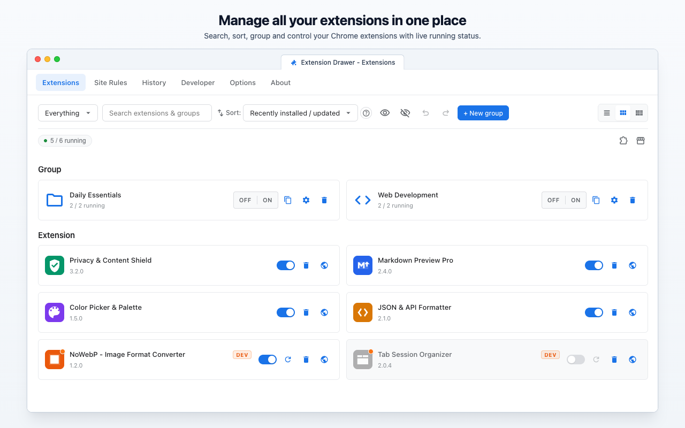
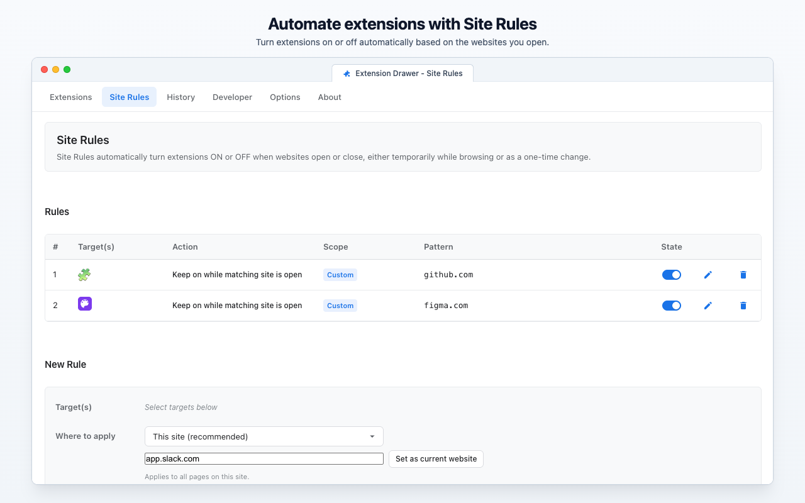
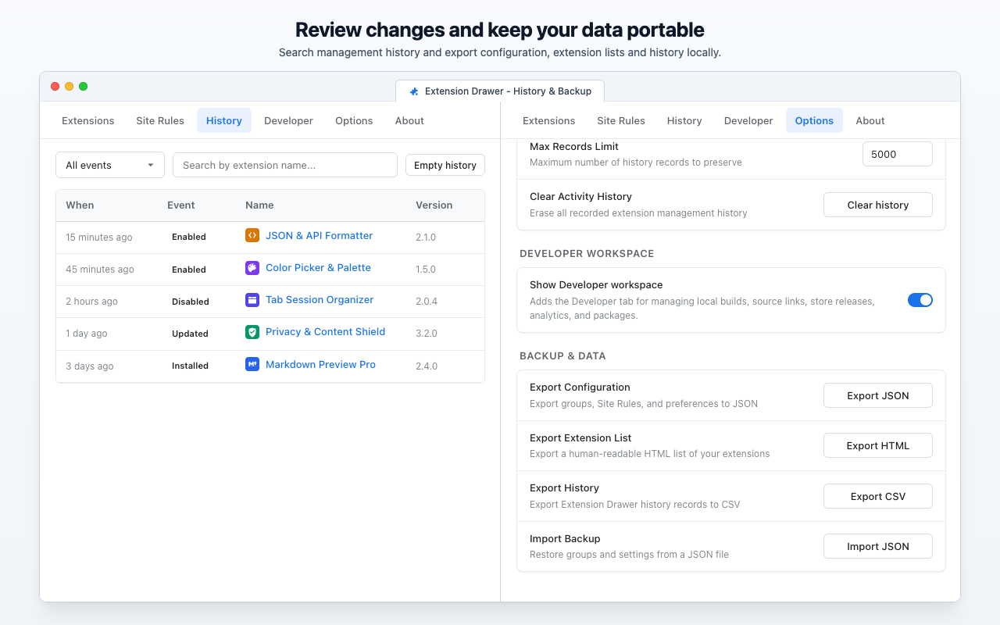
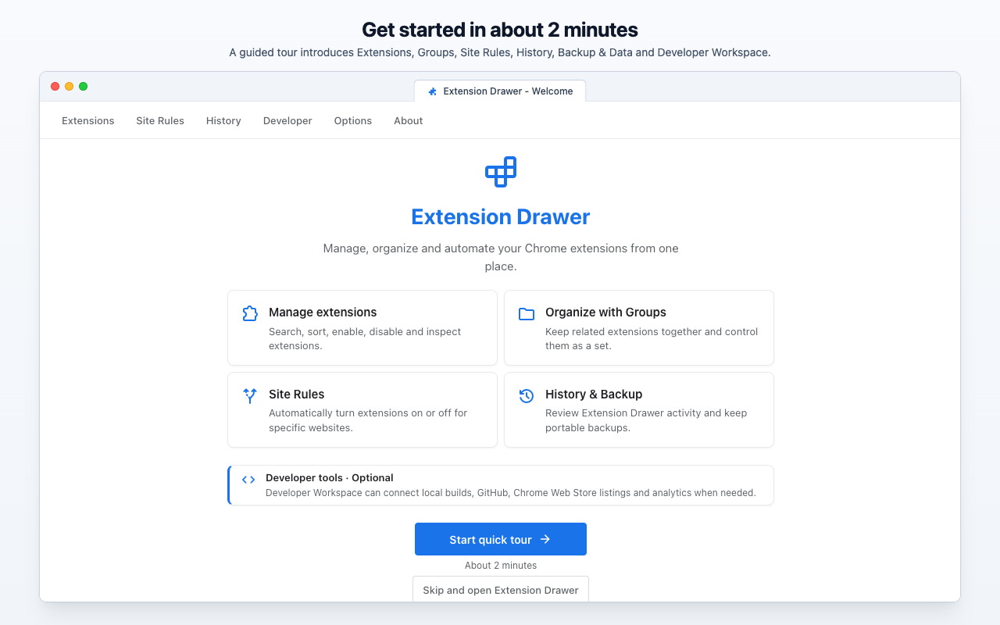
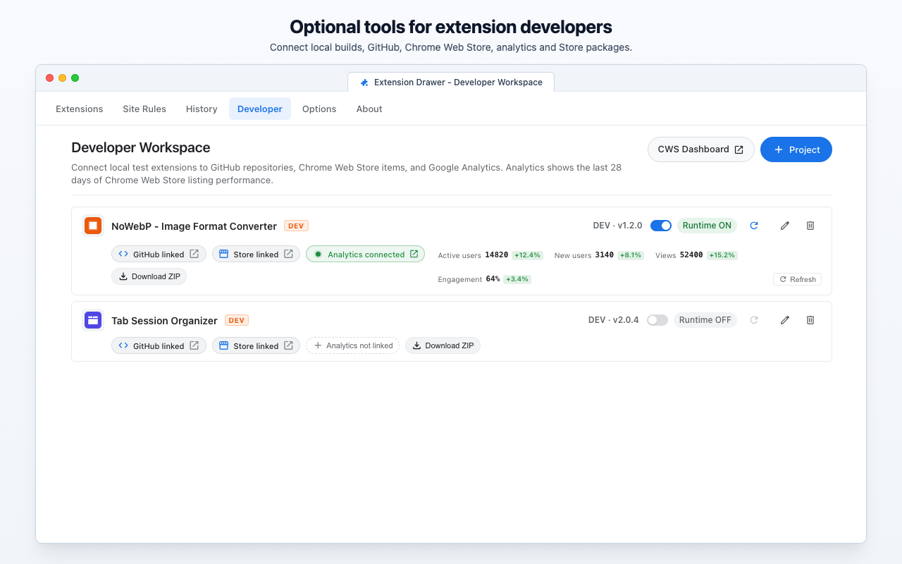

# Extension Drawer

[](https://www.gnu.org/licenses/gpl-3.0)
[](https://developer.chrome.com/docs/extensions/develop/migrate/what-is-mv3)
[](https://chromewebstore.google.com/detail/onkcjpfgllpfbimnchjehboikhippnka?utm_source=item-share-cb)
[]()

> **Extension Drawer** is an independent Manifest V3 browser extension manager built from and inspired by the open-source **NooBoss** project originally created by [AInoob](https://github.com/AInoob).

<p align="center">
  
</p>

---

## Lineage & Motivation

The original **NooBoss**, created by [AInoob](https://github.com/AInoob) ([Original NooBoss Repository](https://github.com/AInoob/NooBoss)), set the benchmark for visual extension management in Google Chrome. With the ecosystem transition to Manifest V3 and the deprecation of Manifest V2, the original extension became incompatible with modern Chrome releases.

**Extension Drawer** is an independently maintained Manifest V3 continuation. It preserves the classic NooBoss workflow, customizable icon systems, and one-click bulk controls while modernizing the core architecture with a lightweight service worker, robust event tracking, and clean Material Design layout principles.

- **Current Repository**: [Extension Drawer on GitHub](https://github.com/iknoest/NooBoss-MV3-browser-extension-manager)
- **Original Upstream Project**: [NooBoss on GitHub](https://github.com/AInoob/NooBoss)

---

## Key Features

### ⚡ Extension Management
- **Instant Controls**: Enable, disable, inspect Chrome management metadata, open options pages, or uninstall extensions in a single click.
- **Visual Contrast**: Clear visual states and dimmed styling differentiate disabled extensions at a glance without sacrificing switch legibility.
- **Three Flexible View Modes**:
  - **Big Tile**: 2-column balanced layout with quick-action strips and detailed metadata.
  - **List**: Compact 44px rows optimized for high-density scanning.
  - **Tile**: Compact grid (up to 6 columns) with responsive, contained hover and keyboard-focus action overlays.
- **User-Centered Sorting**:
  - *Recently installed / updated*: Surfaces newly added or updated extensions.
  - *Enabled first*: Groups active extensions ahead of disabled ones.
  - *Recently changed*: Sorts by latest management activity (enable, disable, install, update).
  - *Name A–Z*: Alphabetical listing.
- **Search & Filtering**: Real-time filtering by extension name, extension type (extensions, apps, themes), or runtime state.
- **Live Status Summary**: Operational summary badge (`X / Y running`) reflecting real-time extension state with one-click filtering.
- **Store Package ZIP Download**: Download unpacked `.zip` archive packages directly from Chrome Web Store for supported extensions.

### 🏷️ Command-Based Groups
- **One-Shot Bulk Commands**: Groups feature a clean `[ OFF | ON ]` segmented control that quickly enables or disables all eligible group members in a single gesture.
- **Live Running Counters**: Every group displays its real-time operational status (e.g. `5 / 6 running`).
- **Harmonious Overlap**: Groups act as convenient command shortcuts rather than persistent desired-state loops. Overlapping group memberships and individual extension toggles work together naturally without state-fighting.
- **Edge-Case Safety**: Uninstalled extensions (`· 1 missing`) and policy-restricted extensions (`· 1 unavailable`) are clearly identified without blocking batch execution for remaining members.
- **Customizable Icons**: Over 3,000 self-hosted Google Material Symbols, curated presets, and custom icon uploads.

---

<p align="center">
  
</p>

---

### 🌐 Automate with Site Rules
- **Context-Aware Rules**: Automatically turn extensions ON or OFF based on the websites you open and close.
- **Flexible Scope Matching**:
  - *This Site*: Domain and subdomain matching (e.g. `github.com`).
  - *Exact page*: Specific URL matching (e.g. `https://example.com/editor`).
  - *Custom*: Wildcard patterns (e.g. `*.slack.com`) or advanced regular expressions.
- **Clear Rule Lifecycle**:
  - *Temporary while open*: Turns extensions ON (or OFF) while matching tabs are open, and automatically reverses the state when the last matching tab closes.
  - *One-time on open*: Applies the change once upon opening the site without reverting upon exit.
- **Local Evaluation**: Site URLs are evaluated transiently in local browser memory against your configured rules. Visited URLs are never saved to history and never transmitted over any network.

### 📜 Management History
- **Audit Trail**: Records timestamped events for extension installations, updates, enables, and disables.
- **Filter & Search**: Real-time filtering by event type (*All*, *Enabled*, *Disabled*, *Installed*, *Updated*) and instant search by extension name.
- **Export History CSV**: Export complete activity logs to a standard `.csv` spreadsheet for backup or audit.
- **Import History CSV**: Safely merge history records from an exported `.csv` file with automatic composite-key deduplication and retention limits.
- **Clear History**: Erase recorded activity log entries at any time directly from the interface.

### 💾 Backup & Data Portability
- **Single Canonical Location**: Comprehensive data backup, export, and import is centralized under **Options → Backup & Data**.
- **Export Configuration (JSON)**: Export your groups, Site Rules, and user preferences into a portable `.json` file.
- **Import Configuration (JSON)**: Restore groups, Site Rules, and preferences from a previously exported `.json` configuration file.
- **Export Extension List (HTML)**: Generate a clean, human-readable HTML catalog of all your installed extensions with direct Web Store links.
- **Export History (CSV)**: Export the complete activity history audit trail as a standard `.csv` spreadsheet.
- **Import History (CSV)**: Safely merge activity records from an exported `.csv` file with automatic composite-key deduplication and retention limits.

<p align="center">
  
</p>

---

### 🧭 Built-in Getting Started Walkthrough
Extension Drawer includes a lightweight, 6-step guided walkthrough available on first run and accessible anytime from **About → Getting started**:
1. **Manage extensions**: Learn catalog controls, view modes, and search.
2. **Organize with Groups**: Set up workflow groups and one-shot bulk commands.
3. **Automate with Site Rules**: Configure site-specific extension automation.
4. **Review History**: Explore management activity and diagnostics.
5. **Backup, export and restore**: Discover JSON configuration backups, HTML extension lists, and CSV history exports and imports.
6. **Developer Workspace · Optional**: Overview of optional local build management, store links, and listing analytics.

<p align="center">
  
</p>

---

<p align="center">
  
</p>

---

### 🛠️ Developer Workspace · Optional
For extension creators and engineers, Extension Drawer offers an optional developer hub that remains completely hidden until explicitly enabled in Settings:
- **Local Unpacked Projects**: Link local test extensions with one-click reload controls and manifest diagnostics.
- **Repository & Store Quicklinks**: Direct links to GitHub repositories and Chrome Web Store listings.
- **Read-Only Store-Listing Analytics**: Connect Google Analytics 4 (GA4) property data via official Google OAuth to view 28-day listing metrics (active users, new users, page views, engagement rate).
- **Store Package ZIP Download**: Retrieve production CRX/ZIP packages from official Chrome distribution endpoints for local inspection.
- **Strictly Optional**: Non-developer users never encounter developer UI, OAuth prompts, or developer permissions.

---

## Privacy & Permissions

### Architecture & Data Handling
Extension Drawer is built on an honest **local-first** architecture:
- **Local-First Core**: Core extension management remains strictly local-first. Groups, Site Rules, settings, and History are stored and processed entirely on your device in `chrome.storage.local`.
- **No Behavioral Telemetry**: Extension Drawer does not operate its own behavioral, advertising, or usage telemetry servers.
- **No Data Monetization**: We never sell, rent, monetize, or broker personal or browsing data.
- **Explicit Optional Integrations**: Optional Developer integrations connect to external Google/Chrome services only after explicit user action (e.g. connecting Google Analytics or downloading extension ZIP packages). Non-developer users never trigger external connections.

### Permission Transparency
Permissions are strictly categorized into core required permissions and user-initiated optional permissions:

#### 1. Core Required Permissions
| Permission | Rationale |
| :--- | :--- |
| `management` | Required to query installed extensions, toggle enabled state, inspect metadata, and trigger uninstalls. |
| `storage` | Stores groups, Site Rules, management history, and user settings locally via `chrome.storage.local`. |
| `tabs` | Used in memory to evaluate open tab URLs against user-configured Site Rules. |
| `notifications` | Displays optional local alerts when Site Rules trigger or when extension updates occur. |

#### 2. Optional Permissions (User-Initiated Only)
| Permission / Host | Rationale | Activation Trigger |
| :--- | :--- | :--- |
| `downloads` | Required to save downloaded extension ZIP packages to your default download directory. | Explicitly clicking "Download ZIP". |
| `https://clients2.google.com/*`<br>`https://clients2.googleusercontent.com/*` | Official Google Chrome Web Store endpoints used to download CRX/ZIP archives. | Explicitly clicking "Download ZIP". |
| `identity` | Required for Chrome's native OAuth token flow (`chrome.identity.getAuthToken`). | Explicitly connecting Google Analytics in Developer Workspace. |
| `https://analyticsdata.googleapis.com/*` | Official Google Analytics Data API endpoint used to retrieve read-only listing performance statistics. | Explicitly connecting Google Analytics in Developer Workspace. |

For full policy details, consult our [Privacy Policy](PRIVACY.md).

---

## Installation

### Install from the Chrome Web Store
**Extension Drawer: Extension Manager & Organizer** is available on the Chrome Web Store:

[**Install Extension Drawer from the Chrome Web Store →**](https://chromewebstore.google.com/detail/onkcjpfgllpfbimnchjehboikhippnka?utm_source=item-share-cb)

### Build & Load from Source (Developer Mode)

```bash
# 1. Clone the repository
git clone https://github.com/iknoest/NooBoss-MV3-browser-extension-manager.git
cd NooBoss-MV3-browser-extension-manager

# 2. Install dependencies and compile
npm install
npm run build

# 3. Load unpacked in Chrome
# - Open chrome://extensions
# - Enable "Developer mode" (top right)
# - Click "Load unpacked" and select the dist/ directory
```

---

## Development & Testing

```bash
# Run unit tests (Vitest)
npm test

# Check TypeScript types
npm run typecheck

# Run ESLint
npm run lint

# Production build
npm run build

# Build release package ZIP
npm run package
```

---

## License & Credits

- **Inspiration & Lineage**: Based on [NooBoss](https://github.com/AInoob/NooBoss) originally created by [AInoob](https://github.com/AInoob).
- **License**: [GNU General Public License v3.0 (GPL-3.0)](LICENSE)
- **Icons**: [Google Material Symbols Rounded](https://fonts.google.com/icons) (Apache License 2.0)
- **Maintainer**: Independently maintained Manifest V3 project on [GitHub](https://github.com/iknoest/NooBoss-MV3-browser-extension-manager).
